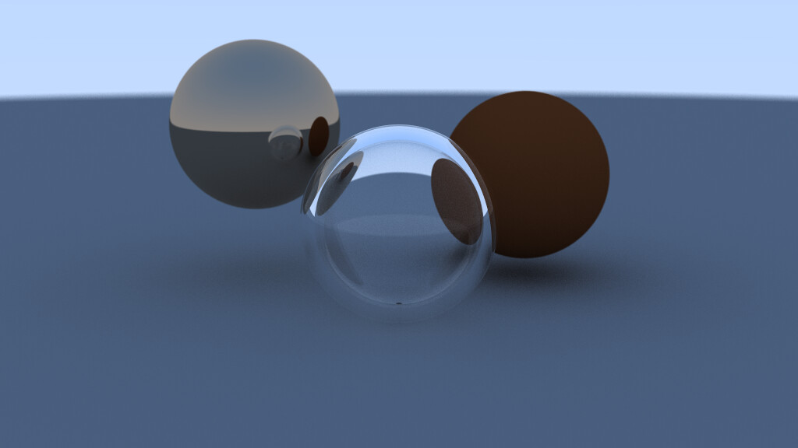

# Ray Tracing
This project uses the following  
- [SFML CMAKE Template](https://github.com/SFML/cmake-sfml-project) for [SFML](https://www.sfml-dev.org/) integration.
- [nlohmann/json](https://github.com/nlohmann/json) for `JSON` parsing in `cpp`.

## Pre-requisites
- [Cmake 3.27](https://cmake.org/) or above
- [Git](https://git-scm.com/)
- A toolchain ([Visual Studio](https://visualstudio.microsoft.com/) is recommended)

## Usage
- Clone the repo
```bash
git clone https://github.com/ChuzaWick420/rayTracing.git
```

- Change directory
```bash
cd rayTracing
```

- Download and config dependencies
```bash
cmake -B build
```

- Build the project
```bash
cmake --build build --config Release
```

- Configure the scene  
The [scene.json](./src/scene.json) file inside `src` directory is used by the engine to generate the final render. It describes the scene and may be edited.

- Run and wait
```bash
build/bin/Release/main.exe
```

## Results
#### Near completion

#### Final Render


## Documentation
The documentation is available on my [notes_publisher](https://chuzawick420.github.io/notes_publisher/Projects/rayTracing/proj_raytracing_main/).
