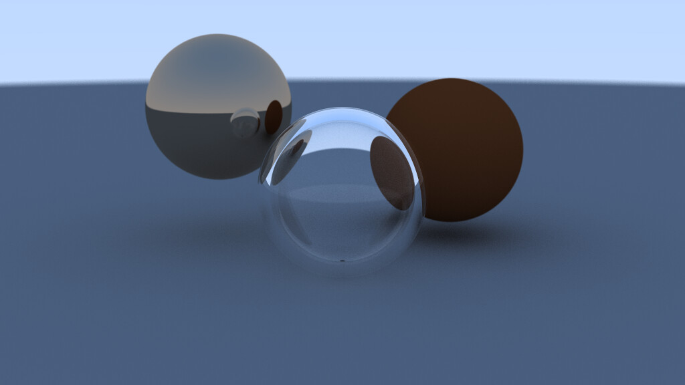

# Ray Tracing
This project uses the [SFML CMAKE Template](https://github.com/SFML/cmake-sfml-project) for [SFML](https://www.sfml-dev.org/) integration.

## Usage
- Clone the repo
```bash
git clone https://github.com/ChuzaWick420/rayTracing.git
```
- Download and config dependencies
```bash
cmake -B build
```
- Build the project
```bash
cmake --build build --config Release
```
- Run and wait
```bash
build/bin/Release/main.exe
```

## Results
#### Near completion

#### Final Render

